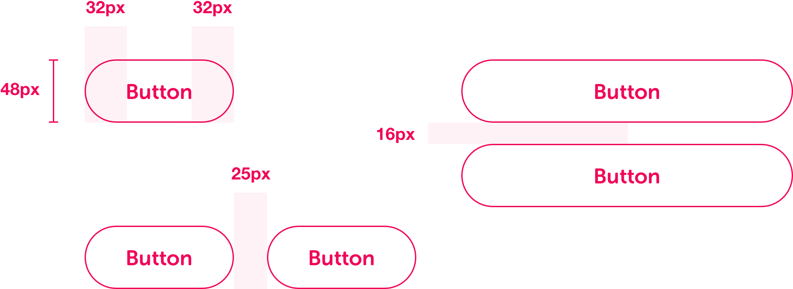
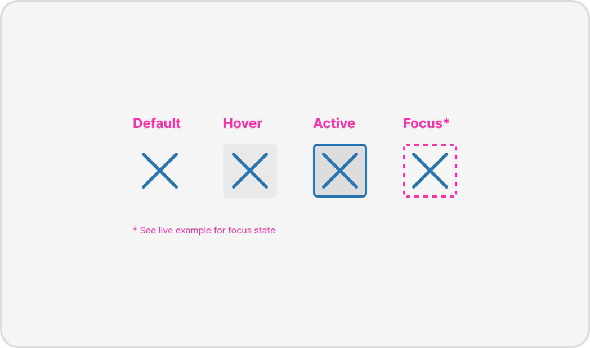

# Buttons

## Introduction

Buttons are used to present actions a user is able to take.

Please refer to the live example for styling:




The live example is for demo purposes only. Please make sure that the correct HTML and CSS syntax is used in production and that you adhere to any standards or practices you may have.


### Anatomy

#### Spacing & global styling

* Buttons contained in narrow spaces or used in the X-Small breakpoint should fill 100% of the width available to them. This helps with cleaner alignment with other elements in that column, and also aligns multiple buttons when stacked.
* If multiple buttons are **horizontally aligned**, there should be a 25px margin separating them.
* If multiple buttons are **stacked vertically**, there should be a 16px margin separating them.



```css
font-face: Museo Sans Rounded;
font-weight: 700;
font-size: 16px;
line-height: 24px;
```

## Variations

### Primary button

* These are action oriented buttons – 'Done', 'Save', 'Next', 'Submit' – and are normally the primary positive action in any scenario.
* Ideally there should only be one Primary button on any screen/scenario, highlighting the core action to proceed/progress/take action on the page. If there isn’t any one clear primary action, then consider using one or a combination of the other button styles.
* Can be used in isolation or in conjunction with one or more secondary buttons.

### Secondary button

* Similar to the Primary button, but intended to play a more supportive or less important action button role.
* Well suited to situations where there are multiple call to actions present \(e.g. when there are a multiple buttons, all with equal weighting\).
* Can be used in isolation or in conjunction with one primary or multiple secondary buttons.

### Destructive button

* Used to represent actions that are destructive and non-recoverable.

### Conversion button

* Used on the penultimate screen of an acquisition, application or process journey, usually on a review or confirm screen.
* The button is presented as disabled if the user needs to complete one or more actions on the review/confirm screen before completing the process.

## Icon only buttons



### Anatomy


### States



### Rules


Icons must **always** be accompanied by a clear label with the exceptions of the icons listed below.


* Used when the icon alone is a standard practice or ubiquitous that it's very unlikely the user will mistake the action the icon is trying to communicate.
* The list of acceptable uses is:

| Icon | Name | Usage |
| :--- | :--- | :--- |
|  | Close | Used to close modals or inline information |
|  | Search | Indicate the presence of a search function |
|  | Account | Indicate the presence of account functionality |
|   | Twitter | To navigate to Twitter |
|   | Facebook | To navigate to [https://en-gb.facebook.com/](https://en-gb.facebook.com/) |
|   | Email | To open an email client with the address desired address pre-filled |
|   | Refresh | To refresh a view or content list |
|   | Home | To navigate to the root of the site |
|   | Settings | To open settings menu or modal |
|   | Delete/Remove | To delete or remove an item |


