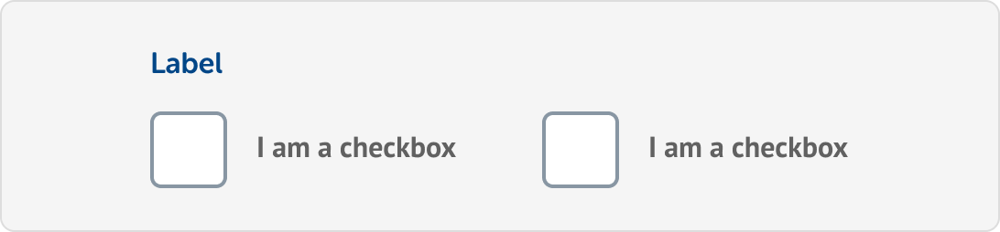
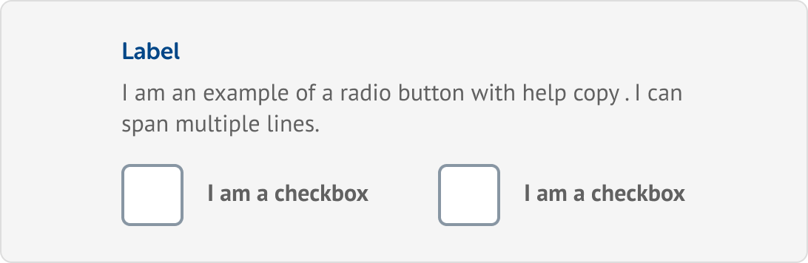

# Checkboxes

## Introduction

Checkboxes are used when the user has multiple options, and can select one or more of of those options.

Please refer to the live example for styling:




The live example is for demo purposes only. Please make sure that the correct HTML and CSS syntax is used in production and that you adhere to any standards or practices you may have.


### Anatomy

| Item | Label | Optional | Rules |
| :--- | :--- | :--- | :--- |
| 1 | Label | **Yes** | N/A |
| 2 | Checkbox | No | N/A |
| 3 | Value | No | N/A |
| 4 | Error highlight | No | N/A |
| 5 | Error icon | No | N/A |
| 6 | Error help text | No | N/A |


**The label element is optional when this component is paired with a H1, H2, or H3, where the heading is acting as the label.**


## Layout

### Stacked

Stacked checkboxes are the default layout and and should cover most uses. Checkboxes should should be stacked with a 16px bottom margin.

Text labels can wrap onto multiple lines.

### Horizontal

Horizontal checkboxes must only be used for questions with only **two answers**. 

Text labels must not wrap onto multiple lines. If this is unavoidable, and copy cannot be re-written then stacked checkboxes must be used instead.

## States

### Default

The default state that this component will be in when the page loads. This state indicates that nothing is currently wrong with the input. In some cases, this component could be _focused_ by default to improve usability.

### 

### Checked

This state serves as the components selected state and indicates the choice the user has made.

### 

### Focus

This state provides the user with a visual indication of which field has the current focus. Screen readers will interpret this programatically so ensure that the correct syntax has been used when developing.

### 

### Error

This state is used to indicate that an error has occurred. This is communicated by combining visual changes and additional elements. We use a horizontal line, changing label colour and the addition of help text. Help text must appear below the options and be a concise summary of how to resolve the error. 

### 

### Error with focus

Same as the _Error_ and _Focus_ state, just combined.

### 🚫 Success/Filled


The success state \(green border\) has been depreciated. The absence of any error is enough feedback for the user.


## Variations

### Checkboxes with help text

