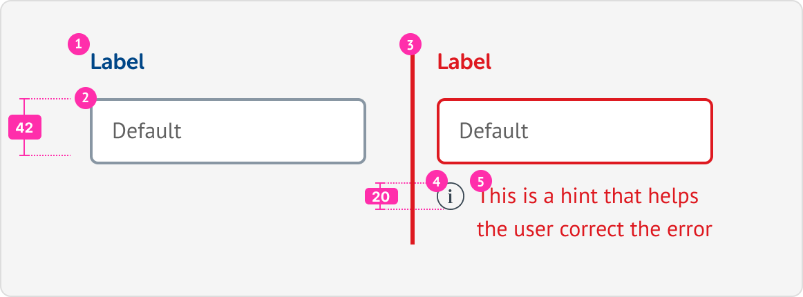
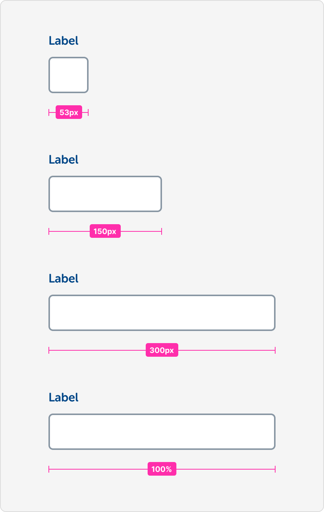
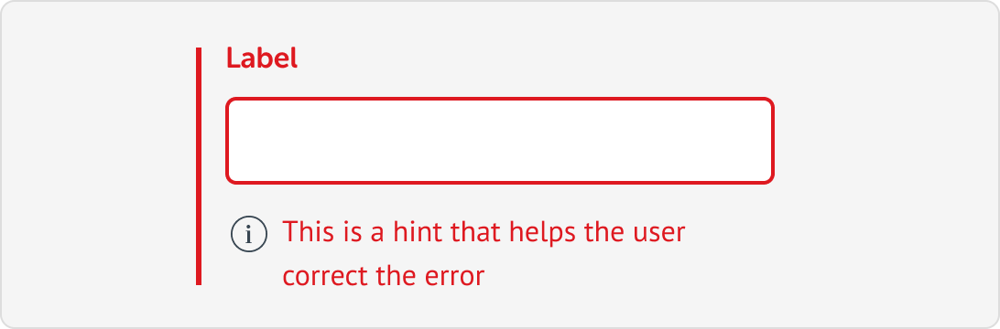
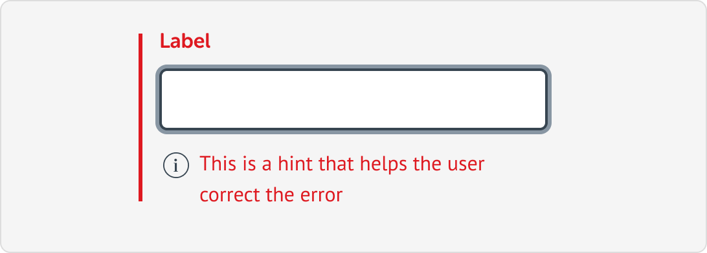
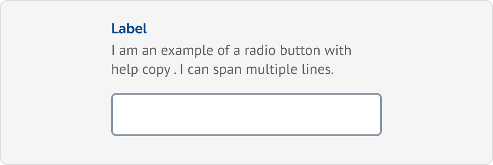

# Text input

## Introduction

Text inputs allow the user to input and edit data.

Please refer to the live example for styling:




The live example is for demo purposes only. Please make sure that the correct HTML and CSS syntax is used in production and that you adhere to any standards or practices you may have.


### Anatomy


Left padding has been updated to 12px to account for all existing breakpoints.


| Item | Label | Optional | Rules |
| :--- | :--- | :--- | :--- |
| 1 | Label | No | N/A |
| 2 | Input | No | N/A |
| 3 | Error highlight | No | N/A |
| 4 | Error icon | No | N/A |
| 5 | Error help text | No | N/A |

## Layout

### Widths

| Size | Px | Rules |
| :--- | :--- | :--- |
| Small | 53px | Inputs of 2-4 characters only |
| Medium | 150px | Inputs that are longer than 4 characters but sill relatively short \(e.g. title\) |
| Large | 300px | Everything else |
| Full-width | 100% | For use in mobile breakpoints and small containers to achieve a better visual layout.  |

## States

### Default

The default state that this component will be in when the page loads. This state indicates that nothing is currently wrong with the input. In some cases, this component could be _focused_ by default to improve usability.

### 

### Focus

This state provides the user with a visual indication of which field has the current focus. Screen readers will interpret this programatically so ensure that the correct syntax has been used when developing.

### 

### Error

This state is used to indicate that an error has occurred. This is communicated by combining visual changes and additional elements. We use a horizontal line, changing label colour and the addition of help text. Help text must appear below the options and be a concise summary of how to resolve the error. 

### 

### Error with focus

Same as the _Error_ and _Focus_ state, just combined.

### 🚫 Success/Filled


The success state \(green border\) has been depreciated. The absence of any error is enough feedback for the user.


## Variations

### Text-input with help text

