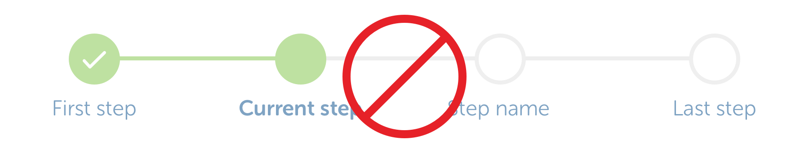

# Progress Bar \(depreciated\)

This has been depreciated \(as of 01/09/18\) and is no longer used. Our processes are optimised to be as quick as possible, negating the need to tell the user in detail where they are in the process.

