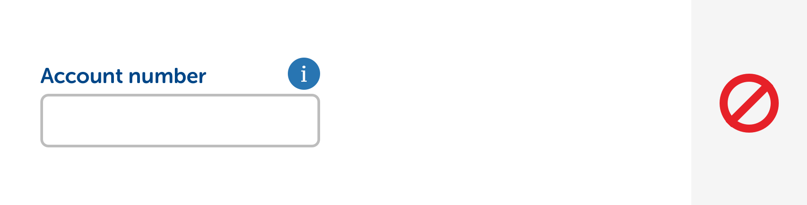
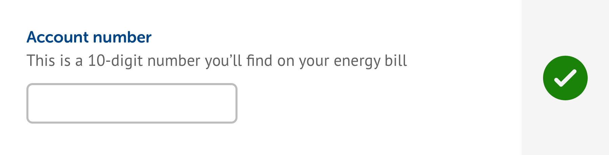
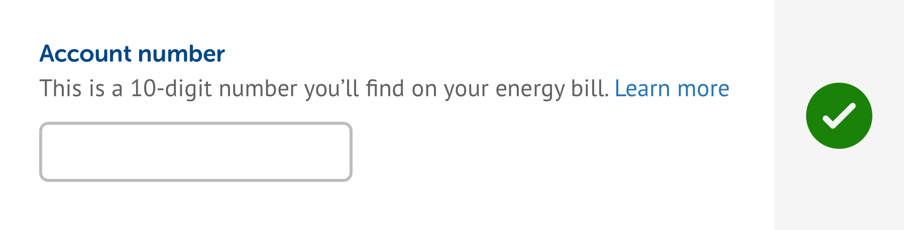

# Tooltips \(depreciated\)

These have been depreciated \(as of 11/02/19\) and are no longer used. We strive to make our interfaces easy to understand without forcing an interaction from the user, so if you think you need to use a tooltip, consider adding more content to the main UI instead. Alternatively, you can use a combination of a text link that opens a modal overlay to add more context if required.

Traditionally, tooltips have been used to contain more information about a particular question or input. However, if this information is useful for the user to help them complete their task it should be part of the main interface, as shown in the example below.

In the above example, the information that would traditionally be contained within a tooltip is placed on the main interface. This means the user has to do no extra work to get the required context.

If there is more information to show, but it's not information that's critical to the completion of a task, the information can be contained in a modal that's invoked by a text link.

