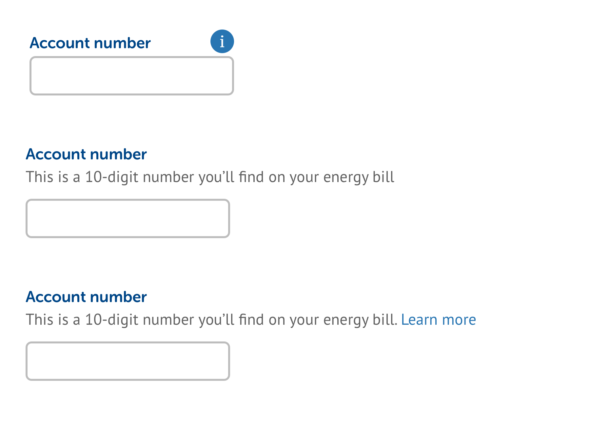

# Tooltips \(depreciated\)

These have been depreciated \(as of 11/02/19\) and are no longer used. We strive to make our interfaces easy to understand without forcing an interaction from the user, so if you think you need to use a tooltip, consider adding more content to the main UI instead. Alternatively, you can use a combination of a text link that opens a modal overlay to add more context if required.

The first example above shows how a tooltip is traditionally used: to give a question or input more context. However, if this information is useful for the user to help them complete their task it should be part of the main interface, as shown in the second example. This negates the need for a tooltip.

The third example shows how we handle scenarios where there is more information to show, but it's not information that's critical to the completion of a task. The 'Learn more' link opens a modal with more content.

