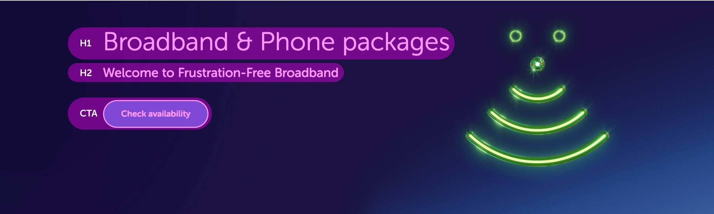

# Homepage & Hub Hero Content

There are three content elements that reside on the hero hubs, a H1, H2 and the CTA. When creating the content for these elements please follow these guidelines:

## H1 guidelines

* 30 characters including spaces
* Max two lines on a desktop
* Content layout size can be either 1/2 or 2/3, but ideally 1/2 to give the image focal point breathing space to the right of the content

#### Hub pages

* Hub page H1 should be the page title or describe the page contents and function to the customer. These guidelines should not be deviated from purely for SEO purposes.
* Hub page H1 should only be adapted if there's a strong business case

#### Homepage

* Homepage H1 content can change depending on business needs

## H2 guidelines

This content should describe the main objective of the page or any offers the business are looking to push to our customers that link to the CTA below

* 75 characters including spaces
* Max two lines on a desktop


For both H1 and H2 the 'max two lines on a desktop' guideline is to ensure the content does not compromise the design on varying breakpoints, please ensure the new content is tested on tablet and mobile devices.


## CTA guidelines

* Two to three words
* Begin with an imperative such as "find", "get", "sign up" to set expectation to the customer


If the CTA relies on the context of banner copy i.e. "Find out more", use the "Hidden text" field to add explanatory text for Accessibility.


