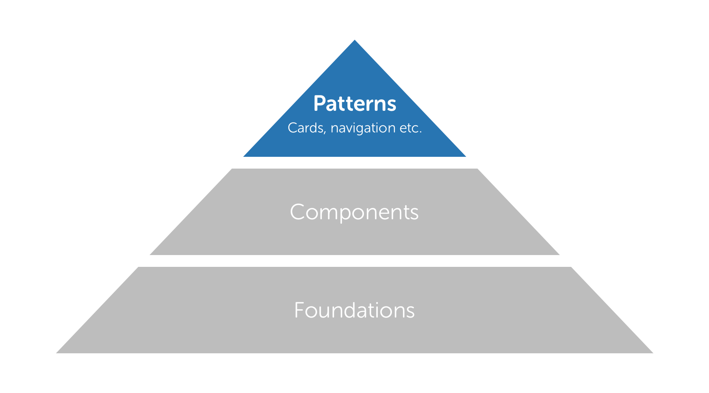

# Our Design System

## A system that encourages consistency, not uniformity

The SSE design system is comprised of three elemental parts: **foundations**, **components** and **patterns**. Deliberately basic, the nature of this system allows for flexibility in execution, ensuring that our work is **consistent but not uniform**.

**Consistency** is a feeling of familiarity: with a brand, a service, or interactions. It helps guide users through a digital service and removes mental friction. As an example, all SSE websites don't have to look identical, but they should all look like they're part of the same digital family and, where appropriate, rely on the same conventions.

**Uniformity** is where everything looks, feels and works the same. This is neither desirable or workable within digital: a mobile app relies on a completely different set of interaction paradigms to that of a website.

## Foundations

Foundations are the building blocks of SSE Digital design. They're the DNA of the SSE Digital Brand and are evident in everything we create. Examples include colours, typography and how we speak to our users.

## Components

Components are distinctive UI elements that are used repeatedly throughout our digital products. Examples include buttons, form inputs, toggles and tooltips. Consistent UI components make a huge difference in guiding a user through a product smoothly and efficiently.

## Patterns

Patterns are recurring element\(s\) that appear throughout our products. Examples include navigation, cards, forms and modal windows. Maintaining consistency in pattern usage ensures our products remain familiar and usable.  
  
  
  

