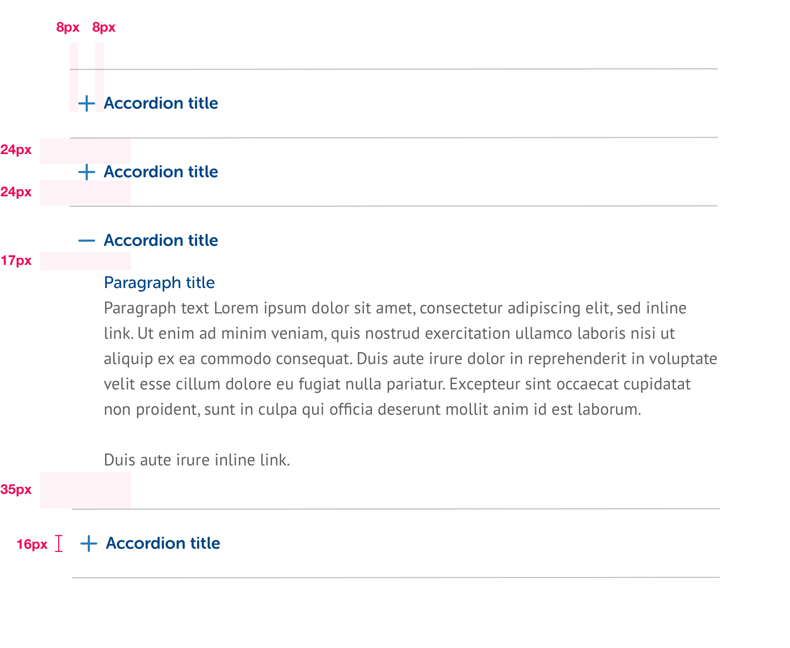
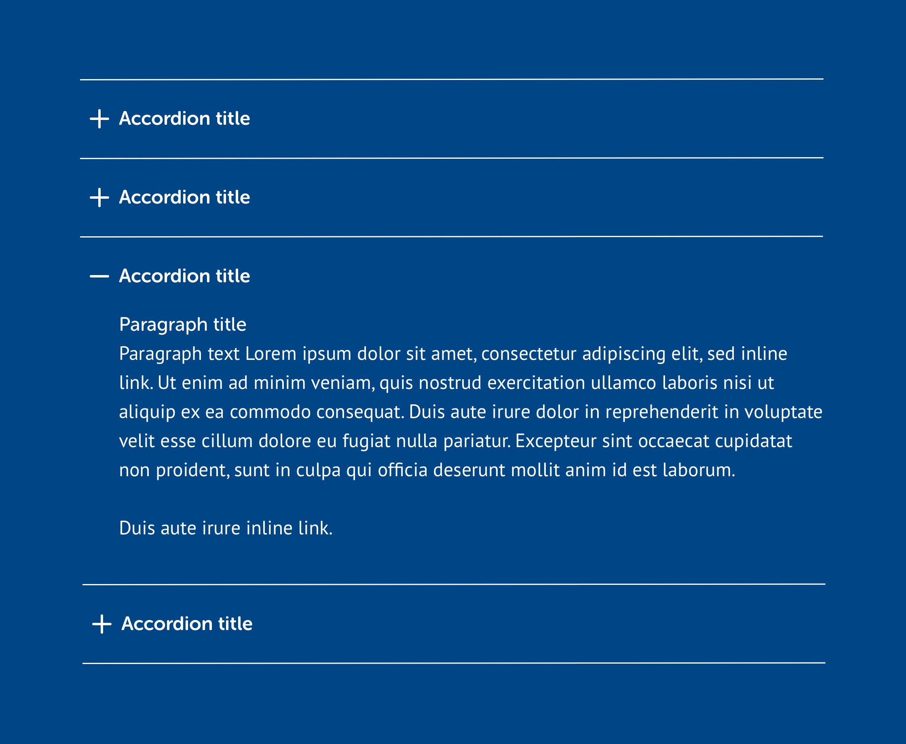

# Accordions





```css
/* Accordion title */
font-face: Museo Sans Rounded;
font-weight: 700;
font-size: 16px;
line-height: 24px;
color: $primaryBlue or white;
icon-color: $secondaryBlue or white;

/* Linework */
color: $secondaryGrey or white;
weight: 1px solid;
```


