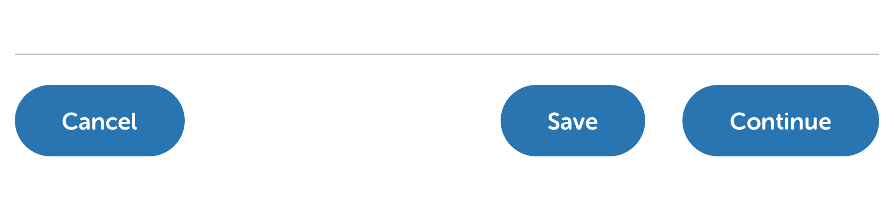
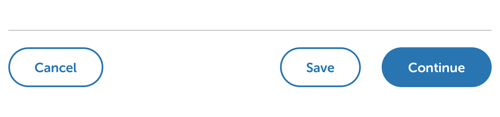

# Labelling & Hierarchy

## Button labels

Button labels should always be clear, descriptive, action-orientated and short. Try to use a maximum of 2-3 words to convey what each button does.

**Context is important:** the page the button sits on will give your button labels additional context, so always consider this when assigning labels to buttons. For example, within a registration flow where the user is setting up a service, the final screen that completes the process could contain a button labelled "Finish" – this makes it clear the user is almost done with the registration process. However, within a different process \(e.g. making a payment\) a button labelled "Finish" does not provide enough context or reassurance for a user – have they made the payment yet? Will they have a chance to review it first? Are they done yet? In that instance, a button labeled "Make payment" is much more appropriate.

Button labels are always **Sentence case** \(where only the first word and proper nouns have initial capitals\).

| Use | Instead of |
| :--- | :--- |
| Submit reading | Give us a meter reading |
| Register | Register for your online account |
| Make payment | Finish |
| Continue | continue |

## Button hierarchy

An appropriate hierarchy of buttons helps to guide users through an interface. Presenting two or more options with the same visual weighting creates an unnecessary stumbling block for the user. In the example below, there are three options presented to the user and all have the same visual weight. How do they know which one we expect/want them to take?

By using an appropriate mix of button styles \(primary & secondary, shown below\), we can create an interface that helps guide the user through the process we expect they want to complete.

