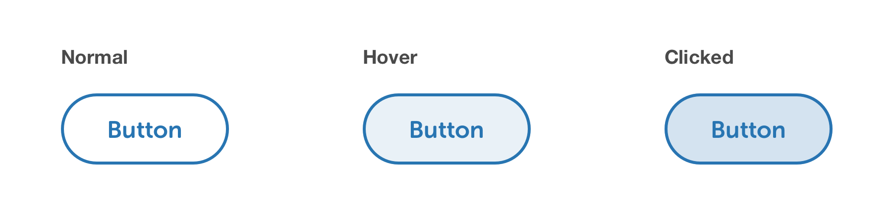
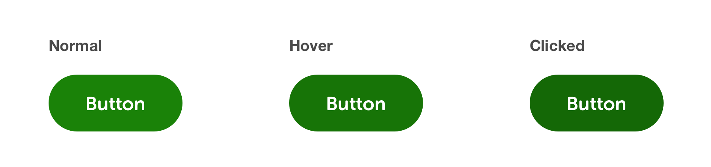
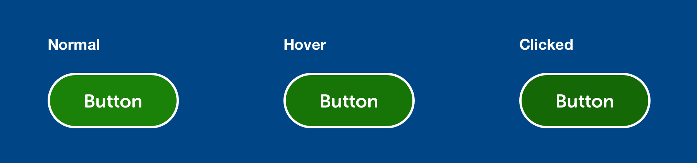

# Buttons


**Note:** All CSS shown is for basic styling purposes. The intention is not to represent publishable code but to help designers & developers foster a common understanding of the specifications.


## Spacing & global styling

* Buttons contained in narrow spaces or used in the X-Small breakpoint should fill 100% of the width available to them. This helps with cleaner alignment with other elements in that column, and also aligns multiple buttons when stacked.
* If multiple buttons are **horizontally aligned**, there should be a 25px margin separating them.
* If multiple buttons are **stacked vertically**, there should be a 16px margin separating them.


```css
font-face: Museo Sans Rounded;
font-weight: 700;
font-size: 16px;
line-height: 24px;
```

## Primary button

* These are action oriented buttons – 'Done', 'Save', 'Next', 'Submit' – and are normally the primary positive action in any scenario.
* Ideally there should only be one Primary button on any screen/scenario, highlighting the core action to proceed/progress/take action on the page. If there isn’t any one clear primary action, then consider using one or a combination of the other button styles.
* Can be used in isolation or in conjunction with one or more secondary buttons.

### Light theme


```css
/* Normal */
background-color: $secondaryBlue;
color: #FFF;

/* Hover */
background-color: #23699F;

/* Clicked */
background-color: #205D8E;
```

### Dark theme


```css
/* Styling is as per 'light' theme plus */
border: 2px solid #FFF;
```

## Secondary button

* Similar to the Primary button, but intended to play a more supportive or less important action button role.
* Well suited to situations where there are multiple call to actions present \(e.g. when there are a multiple buttons, all with equal weighting\).
* Can be used in isolation or in conjunction with one primary or multiple secondary buttons.

### Light theme



```css
/* Normal */
background-color: #FFF;
color: $secondaryBlue;
border: 2px solid $secondaryBlue;

/* Hover */
background-color: #E9F1F7;

/* Clicked */
background-color: #D4E3F0;
```

### Dark theme


```css
/* Normal */
background-color: $primaryBlue;
color: #FFF;
border: 2px solid #FFF;

/* Hover */
background-color: #004687;

/* Clicked */
background-color: #00386C;
```

## Destructive button

* Used to represent actions that are destructive and non-recoverable.

### Light theme


```css
/* Normal */
background-color: $alertRed;
color: #FFF;

/* Hover */
background-color: #CA2B30;

/* Clicked */
background-color: #B4262B;
```

### Dark theme


```css
/* Styling is as per 'light' theme plus */
border: 2px solid #FFF;
```

## Conversion button

* Used on the penultimate screen of an acquisition, application or process journey, usually on a review or confirm screen.
* The button is presented as disabled if the user needs to complete one or more actions on the review/confirm screen before completing the process.

### Light theme



```css
/* Normal */
background-color: $primaryGreen;
color: #FFFFFF;

/* Hover */
background-color: #177407;

/* Clicked */
background-color: #146806;
```

### Dark theme



```css
/* Styling is as per 'light' theme plus */
border: 2px solid #FFF;
```

