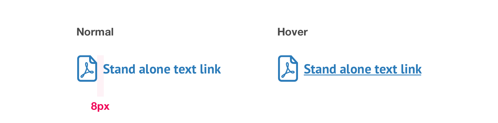

# Text Links

## Standalone links

Standalone links have an optional icon to the left of the text.



```css
font-face: PT Sans Bold;
font-size: 16px;
line-height: 24px;
color: $secondaryBlue;
```


