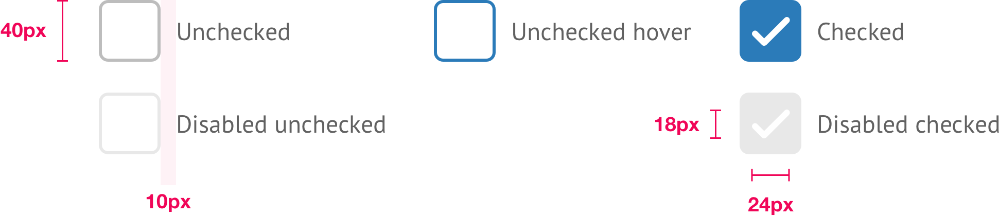

# Checkboxes



```css
/* Global */
corner-radius: 6px;
icon-color: #FFF;
font-face: PT Sans;
font-size: 16px;
line-height: 24px;
color: $secondaryMidGrey;

/* Unchecked */
border: 2px solid $secondaryGrey;
background-color: #FFF;

/* Unchecked hover */
border: 2px solid $secondaryBlue;
background-color: #FFF;

/* Checked */
background-color: $secondaryBlue;

/* Disabled unchecked */
border: 2px solid $secondaryGrey (35% opacity);
background-color: #FFF;

/* Disabled checked */
background-color: $secondaryGrey (35% opacity);
```

