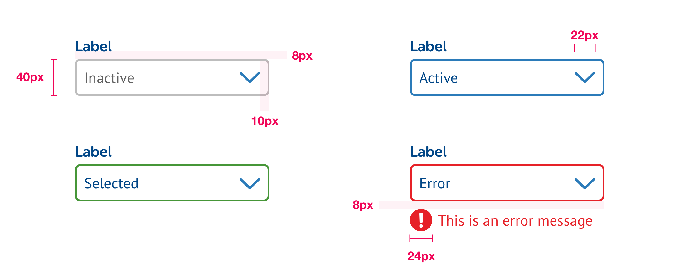

# Dropdown Menus



```css
/* Global */
corner-radius: 6px;
width: dependent on content;
background-color: #FFF;
border: 2px solid;
icon-color: $secondaryBlue;

/* Label */
font-face: Museo Sans Rounded;
font-weight: 700;
font-size: 16px;
line-height: 24px;

/* Field contents */
font-face: PT Sans;
font-size: 16px;
line-height: 24px;

/* Normal */
border-color: $secondaryGrey;

/* Active */
background-color: $secondaryBlue;

/* Complete */
background-color: $primaryGreen;

/* Error */
background-color: $alertRed;
```


