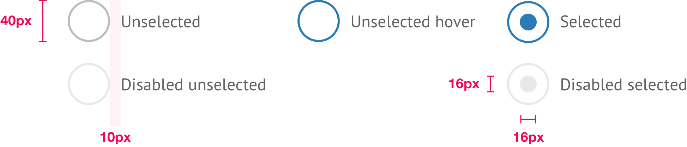

# Radio Buttons



```css
/* Global */
font-face: PT Sans;
font-size: 16px;
line-height: 24px;
color: $secondaryMidGrey;

/* Unselected */
border: 2px solid $secondaryGrey;
background-color: #FFF;

/* Unselected hover */
border: 2px solid $secondaryBlue;
background-color: #FFF;

/* Selected */
border: 2px solid $secondaryBlue;
bullet-color: $secondaryBlue;

/* Disabled unselected */
border: 2px solid $secondaryGrey (35% opacity);
background-color: #FFF;

/* Disabled selected */
background-color: $secondaryGrey (35% opacity);
bullet-color: $secondaryGrey (35% opacity);
```


