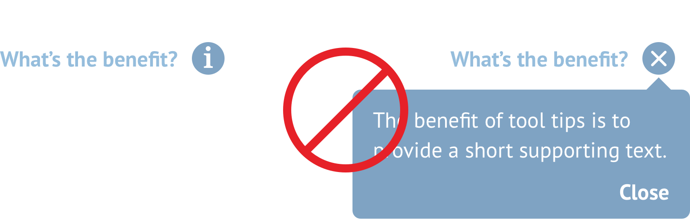

# Tooltips


Note: the design of this component is being updated in early 2019


Tooltips are used for small amounts of supporting text that is useful but doesn’t need to be visible at all times. Content within tooltips should be no more than a sentence or two lines – if your content is longer, use a modal to house it. Modals can be invoked from the same 'i' icon as tooltips.



```css
icon-color: $primaryBlue;
tooltip-box-color: $primaryBlue;
tooltip-box-corner-radius: 6px;
tooltip-text-color: #FFF;
```

