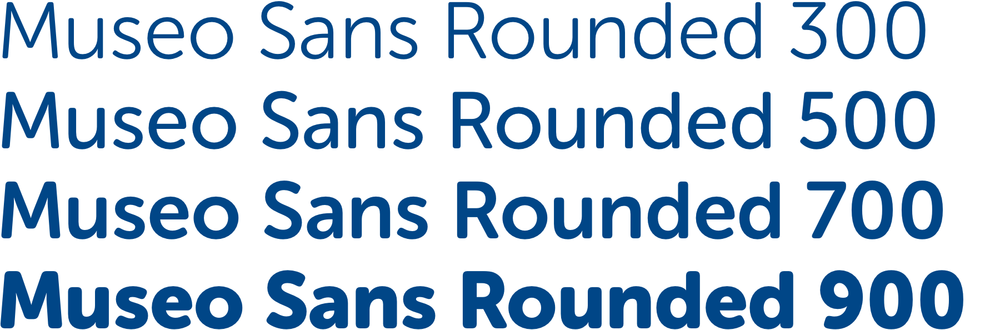

# Typography

## Typography guidelines

* Never end a header or label with a full stop \(.\) – only use a full stop for sentences, paragraphs and main body copy.
* Where possible, use [sentence case ↗](https://en.wikipedia.org/wiki/Letter_case#Sentence_case) for titles, labels & headings. It's more conversational, easier to read and better reflects how humans communicate with each other \(e.g. we don’t use title case for texts, emails or letters\).
* Avoid use of all caps wherever possible. Exceptions can be made for buttons or important pieces of content.

## Fonts

SSE Digital products use Museo Sans Rounded and PT Sans.

### Museo Sans Rounded

Used for headings, sub-headings and buttons. This is a commercial font which cannot be downloaded for free. If you need Museo installed on your machine, speak to your line manager.

### PT Sans

Can be used for body copy, captions, hyperlinks etc. PT Sans is a free font which can be [downloaded from Google Fonts ↗](https://fonts.google.com/specimen/PT+Sans).

