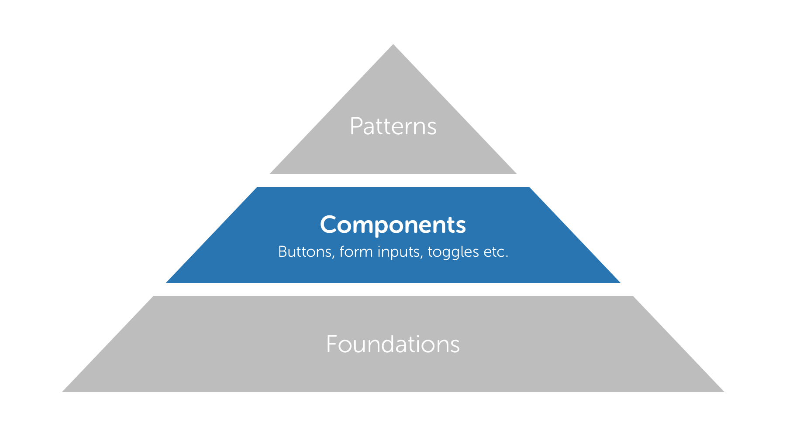

# Our Design System

## A system that promotes consistency

The SSE design system is comprised of three elemental parts: **foundations**, **components** and **patterns**. The nature of this system allows for flexibility in execution, ensuring our work remains **consistent but not uniform**.

**Consistency** lends things a feeling of familiarity, a sense that you know how something works because you've used something similar before. As an example, all scissors work in the same way \(they're consistent\) but not all scissors look the same \(they're not uniform\). Consistency is an important part of our work as it helps guide users through our digital services and removes friction.

**Uniformity** is where everything looks, feels and works the same. This is neither desirable nor practical within digital, where different channels offer different levels of service to different types of user. For example, a mobile app relies on a completely different set of interaction paradigms to those of a website, so to make a website and an app work in precisely the same way would hamper the experience of both.

We value **consistency & appropriateness** over **uniformity & identical**.

## Foundations

Foundations are the building blocks of SSE Digital design. They're the DNA of the SSE Digital Brand and are evident in everything we create.

## Components

Components are distinctive UI elements that are used repeatedly throughout our digital products. Consistent UI components make a huge difference in guiding a user through a product smoothly and efficiently.

## Patterns

Patterns are recurring element\(s\) that appear throughout our products. Maintaining consistency in pattern usage ensures our products remain familiar and usable.  
  
  
  

