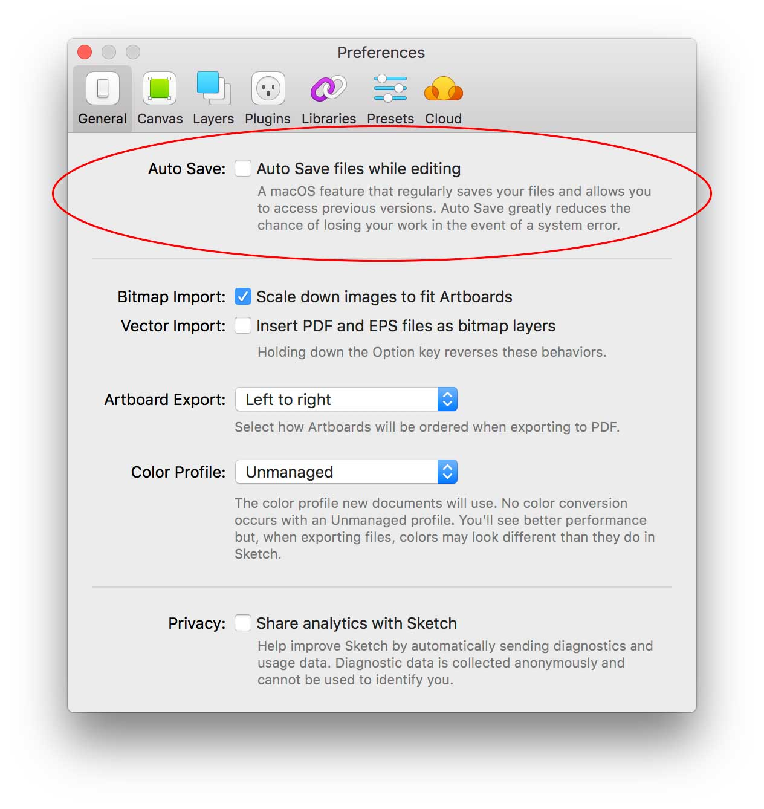

# Sketch

## Where to get Sketch

You can download the latest version of Sketch here: [https://sketchapp.com↗](https://sketchapp.com) . There's a 30 day fully functional free trial.

## Setting up Sketch


#### **Please turn off  'auto save' in Sketch's preferences before opening any Sketch files**


This feature is turned on by default, so you'll need to manually go and turn it off. It's very easy to unwittingly make changes while viewing a Sketch file with auto save on. Also, auto save doesn't play nicely with Adobe Creative Cloud storage, creating multiple 'conflicted copies', leading to clutter and confusion.

## The SSE Digital Sketch Library

We have a centralised, global asset library that contains all the components required to build digital SSE products. Once you install Sketch, you'll need to add the library from within Sketch's preferences:

## Useful Sketch plugins

There are a variety of Sketch plugins we use to simplify aspects of our workflow.

### Sketch Runner

A powerful tool that allows you to run certain commands using keyboard shortcuts. This saves hunting through menus to find the commands you need. Once you've found which shortcuts you personally find useful, Runner starts to become a great time saver.

**Download:** [https://sketchrunner.com](https://sketchrunner.com/)[↗](https://sketchrunner.com/)

### Automate Sketch

A bunch of useful commands that aren't built into Sketch by default. It's great for doing things like "Remove all symbols that aren't being used in this document".

**Download:** [https://ashung.github.io/Automate-Sketch ↗](https://ashung.github.io/Automate-Sketch)

### Sketch Palettes

Allows you to import & export colour palettes. Use it with the master SSE colour palette.

**Download:** [https://github.com/andrewfiorillo/sketch-palettes ↗](https://github.com/andrewfiorillo/sketch-palettes)

### Symbol Instance Renamer

Rename symbol instances to the name of their master.

**Download:** [https://github.com/sonburn/symbol-instance-renamer ↗](https://github.com/sonburn/symbol-instance-renamer)

