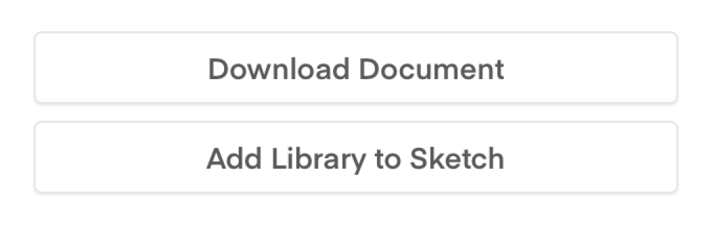
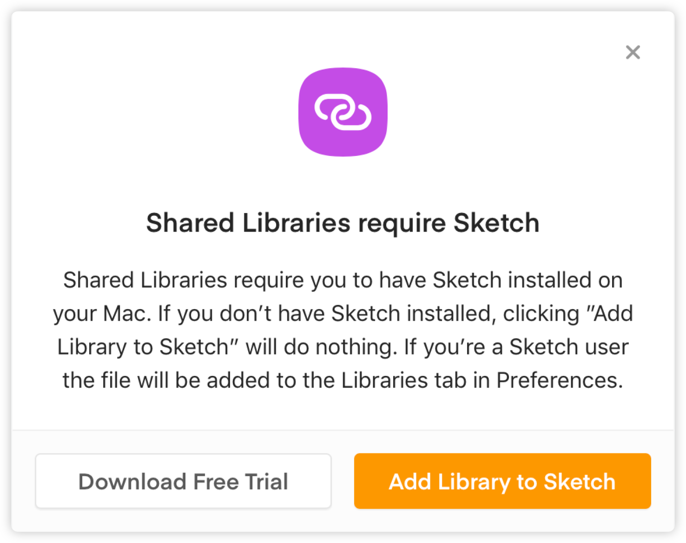

# Sketch

## Downloading Sketch

You can download the latest version of Sketch here: [https://sketchapp.com↗](https://sketchapp.com) . There's a 30 day fully functional free trial.

## Setting up Sketch

Once installed, follow these steps to get Sketch all set up.

### 1. Turn off 'Auto Save'

This feature is turned on by default, so you'll need to manually go and turn it off in Sketch's preferences. **Please do this before opening any Sketch files.** It's very easy to unwittingly make changes while viewing a Sketch file if auto save is turned on.

### 2. Sign into Sketch Cloud

We use Sketch Cloud to store & distribute our Digital Library. You'll need to sign in using the SSE UX credentials – clicking 'Sign In...' takes you to a browser where you log in.

Once you're logged in, you should be redirected back to Sketch.

### 3. Add the Digital Sketch Library

We have a master Sketch library that contains all the components required to build digital SSE products. We store this in Sketch Cloud so that any updates are instantly available to everyone. To add the library to Sketch, go back to Sketch Cloud in the browser \(if you've closed the browser visit [https://sketch.cloud/documents/all-documents↗](https://sketch.cloud/documents/all-documents) to go back\).

Click the 'SSE Digital Library' to view the file – you should see two buttons in the bottom right of the browser window. 

Click the 'Add Library to Sketch' button. This will then prompt you:

 Once you install Sketch, you'll need to add the library from within Sketch's preferences:

## Useful Sketch plugins

There are a variety of Sketch plugins we use to simplify aspects of our workflow.

### Sketch Runner

A powerful tool that allows you to run certain commands using keyboard shortcuts. This saves hunting through menus to find the commands you need. Once you've found which shortcuts you personally find useful, Runner starts to become a great time saver.

**Download:** [https://sketchrunner.com](https://sketchrunner.com/)[↗](https://sketchrunner.com/)

### Automate Sketch

A bunch of useful commands that aren't built into Sketch by default. It's great for doing things like "Remove all symbols that aren't being used in this document".

**Download:** [https://ashung.github.io/Automate-Sketch ↗](https://ashung.github.io/Automate-Sketch)

### Sketch Palettes

Allows you to import & export colour palettes. Use it with the master SSE colour palette.

**Download:** [https://github.com/andrewfiorillo/sketch-palettes ↗](https://github.com/andrewfiorillo/sketch-palettes)

### Symbol Instance Renamer

Rename symbol instances to the name of their master.

**Download:** [https://github.com/sonburn/symbol-instance-renamer ↗](https://github.com/sonburn/symbol-instance-renamer)

