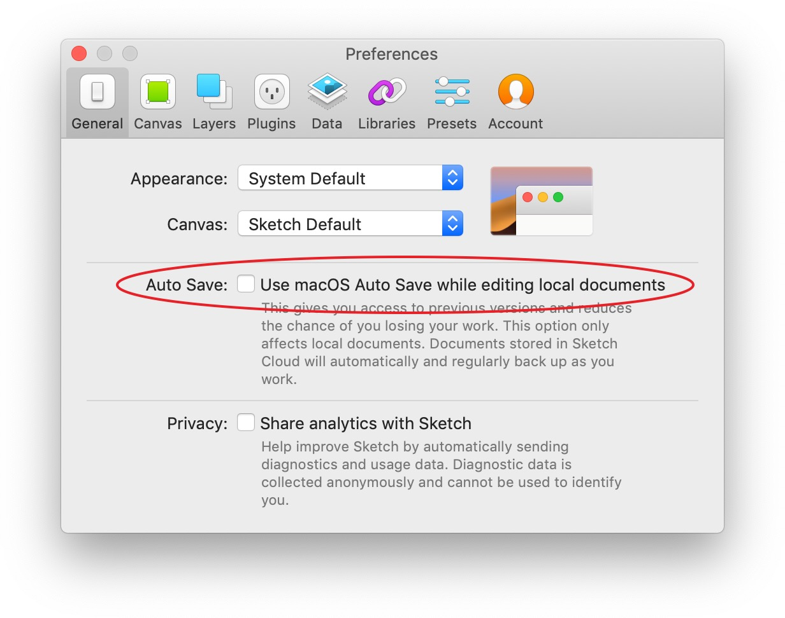

# Sketch

## Downloading Sketch

You can download the latest version of Sketch here: [https://sketchapp.com↗](https://sketchapp.com) . There's a 30 day fully functional free trial.

## Setting up Sketch


**Note:** we are working on moving our Sketch library to Creative Cloud storage. Whilst we do this, do not follow the steps below.


Once installed, follow these steps to get Sketch all set up.

### 1. Turn off 'Auto Save'

This feature is turned on by default, so you'll need to manually go and turn it off in Sketch's preferences. **Please do this before opening any Sketch files.** It's very easy to unwittingly make changes while viewing a Sketch file if auto save is turned on.

### 2. Sign into Sketch Cloud

We use Sketch Cloud to store & distribute our Digital Library. You'll need to sign in using the SSE UX credentials – clicking 'Sign In...' takes you to a browser where you log in.

Once you're logged in, you should be redirected back to Sketch.

## Adding the Digital Sketch Library

We have a master Sketch library that contains all the components required to build digital SSE products. We store this in Sketch Cloud so that any updates are instantly available to everyone.

### 1. Add the Digital Library to Sketch

To add the library to Sketch, go to Sketch Cloud \([https://sketch.cloud/documents/all-documents↗](https://sketch.cloud/documents/all-documents)\) and click the 'SSE Digital Library' to view the file. You should see two buttons in the bottom right of the browser window.

Click the 'Add Library to Sketch' button. This will then prompt you that you need Sketch installed to use shared libraries. Click the orange 'Add Library to Sketch' button.

You should then be directed back to Sketch where you'll see the Digital Library in Preferences &gt; Libraries.

### 2. Download the Digital Library

 Now that you've added the Digital Library to Sketch, you'll need to download it to use it. Clicking the 'Download' button in Preferences &gt; Libraries will download the Digital Library.

## Using the Digital Library

If you're familiar with how to use Libraries, Symbols and Overrides in Sketch, you'll be able to start using the Digital Library straight away. If you're not familiar with these features, the official Sketch website has some great starter content.







## Updating the Digital Library

The SSE Digital Library is a living, breathing document and is updated as & when required. When an update is available, Sketch will notify you \(ensure that notifications are turned on for Sketch in your system preferences\).

### 1. Download the updated Library file

Clicking the notification within Sketch \(or navigating to Preferences &gt; Libraries\) will show the SSE Digital Library with an option to 'Update'.

### 2. Update symbols & instances

Once you've got the updated Library, Sketch will prompt you in the top-right of the app window that the updated library is ready. Clicking this notification will open a sheet showing what's changed.

## Useful Sketch plugins

There are a variety of Sketch plugins we use to simplify aspects of our workflow.

### Sketch Runner

A powerful tool that allows you to run certain commands using keyboard shortcuts. This saves hunting through menus to find the commands you need. Once you've found which shortcuts you personally find useful, Runner starts to become a great time saver.

[https://sketchrunner.com](https://sketchrunner.com/)[↗](https://sketchrunner.com/)

### Automate Sketch

A bunch of useful commands that aren't built into Sketch by default. It's great for doing things like "Remove all symbols that aren't being used in this document".

[https://ashung.github.io/Automate-Sketch ↗](https://ashung.github.io/Automate-Sketch)

### Sketch Palettes

Allows you to import & export colour palettes. Use it with the master SSE colour palette.

\*\*\*\*[https://github.com/andrewfiorillo/sketch-palettes ↗](https://github.com/andrewfiorillo/sketch-palettes)

### Symbol Instance Renamer

Rename symbol instances to the name of their master.

[https://github.com/sonburn/symbol-instance-renamer ↗](https://github.com/sonburn/symbol-instance-renamer)

### Craft

Craft is a bunch of useful plugins that can make the design process easier. It also integrates with our prototyping tool InVision.

[https://www.invisionapp.com/craft ↗](https://www.invisionapp.com/craft)

