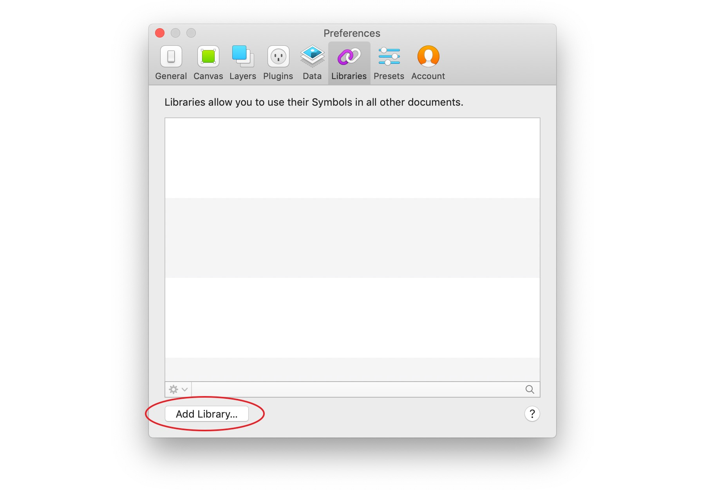

# Adding the SSE Digital Library to Sketch

To add the SSE Digital Library to Sketch, go to Preferences > Libraries in Sketch and click 'Add Library..."

In the dialog box that follows, locate the SSE Digital Library file and click 'Open'.


The library is located in our shared OneDrive space – talk to a member of the UX team if you can't find it.


The SSE Digital Library should now appear in your list of libraries. That's it, you're now ready to use the library!

## 

