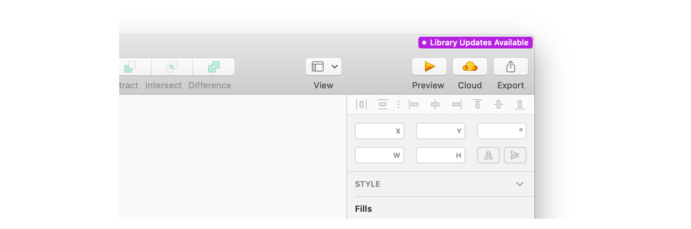
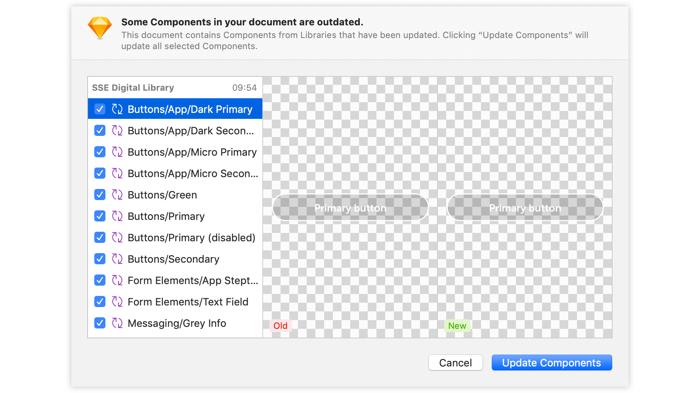

# Staying Up to Date

The SSE Digital Library is a living, breathing document and is updated as & when required. When an update is available, Sketch will prompt you in the top-right of the app window that the updated library is ready. Clicking this notification will open a sheet showing what's changed.

