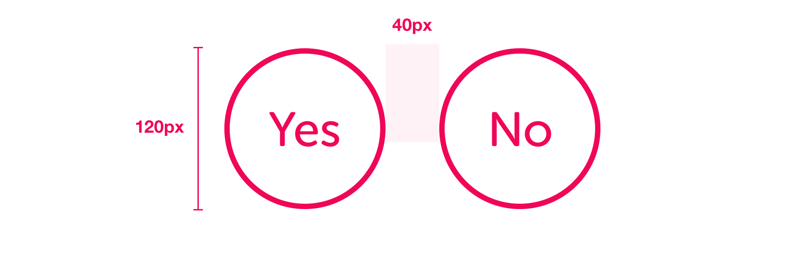
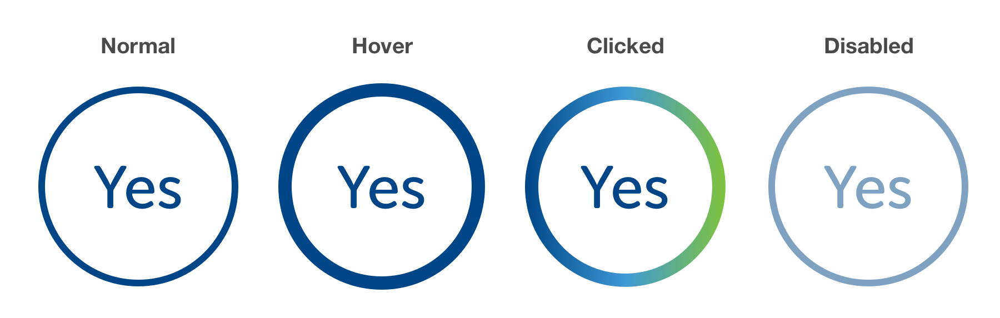
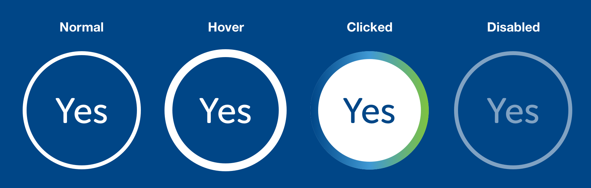
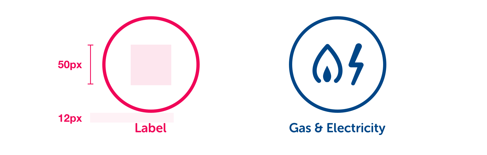

# Roundel Buttons


**Note:** All CSS shown is for basic styling purposes. The intention is not to represent publishable code but to help designers & developers foster a common understanding of the specifications.


## Spacing & sizing



```css
font-face: Museo Sans Rounded;
font-weight: 500;
font-size: 36px;
```

## Light theme



```css
/* Normal */
background-color: #FFF;
color: $primaryBlue;
border: 4px solid $primaryBlue;

/* Hover */
border: 8px solid $primaryBlue;

/* Clicked */
border: 8px solid $sseGradient;

/* Disabled */
background-color: #FFF (50% opacity);
color: $primaryBlue (50% opacity);
border: 4px solid $primaryBlue (50% opacity);
```

## Dark theme



```css
/* Normal */
color: #FFF;
border: 4px solid #FFF;

/* Hover */
border: 8px solid #FFF;

/* Clicked */
background-color: #FFF;
color: $primaryBlue;
border: 8px solid $sseGradient;

/* Disabled */
color: #FFF (50% opacity);
border: 4px solid #FFF (50% opacity);
```

## Roundel with icon

Roundels can be used with icons instead of text. The styling for various states is as above.



```css
font-face: Museo Sans Rounded;
font-weight: 700;
font-size: 16px;
line-height: 24px;
```


