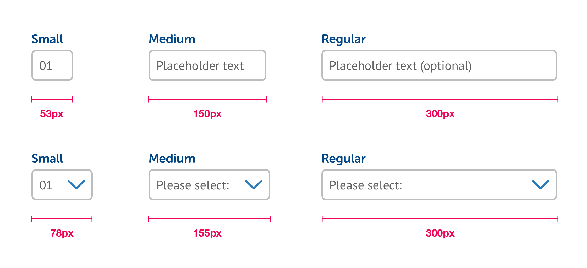

# Widths & Spacing

## Input widths

The width of an input element \(e.g. text field or dropdown menu\) gives the user an instant visual clue as to the length of information required.

* **Small:** inputs of 2-4 characters only
* **Medium:** inputs that are longer than 4 characers but still relatively short \(e.g. title\)
* **Large:** everything else

## Element spacing

When working with a series of form elements, using the appropriate spacing gives the form the right kind of vertical rhythm and ensures our layouts remain clean, understandable and usable.

