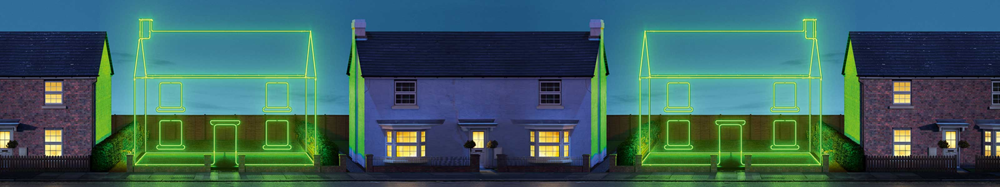

# Composition & Formats

## Composition & aspect ratio

Imagery for our digital spaces has a different set of constraints compared to more traditional channels. Banner or hero imagery is generally rectangular, with an aspect ratio that ranges between 2.5:1 to 5:1 – getting a square image to work appropriately in a rectangular space with that sort of aspect ratio is incredibly time consuming and never results in a quality result.

### Example: the Energy hub

The Energy, Telco and HES hubs all have a header image at the very top. At the large breakpoint, this image is a 1600px x 300px image with an aspect ratio of roughly 5:1.

The approved image for energy has a squarer aspect ratio, is full-bleed from edge to edge and has the main area of interest in the centre of the image:

When we place this image into the rectangular template, ensuring the area of interest is viewable, on the right we're left with large parts of the image that are blank:

This requires the UX team to use existing parts of the image to make something to fill this space. A typical sequence is shown below.

These steps are necessary to prepare the image for the hub, where text sits on the left-hand side of the image and accessibility requires a sufficient contrast between the text and the background image. Preparing imagery in this way is a time-consuming task and often results in an image that is less than optimal.

### The ideal composition

Ideally, the UX team should be supplied with imagery that has sufficient space around the area of interest so that we don't have to try & recreate complex parts of the image.

## Preferred specifications

### Layered PSDs

It's highly preferable for us to use layered PSD files so that we can rework the imagery to fit the digital space whilst preserving as much of the original artwork as possible. The three breakpoints each require a slightly different composition of image, so the more flexibility we have to compose by using a layered PSD, the better our final digital imagery will be.

### High-resolution

Our largest hero image size spans 1600px @2x pixel density – that's a physical width of 3200px. To maintain quality on retina-calibre displays, this is the minimum size we ask for. Ideally, the imagery supplied would be larger \(up to 6400px wide\) to cater for the composition, as explained above.

### Examples of non-digital use

Although not essential, it sometimes helps us to understand what the final non-digital image use looks like, so that we can maintain any essential elements as we transfer the artwork to our digital spaces.

