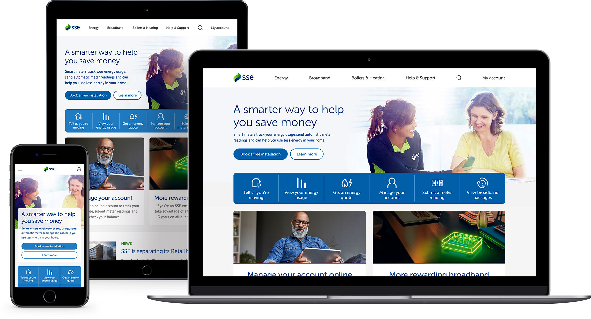

# Homepage Imagery

## Primary hero image

The homepage hero contains the primary message for the SSE homepage. When creating imagery for this asset, either yourself or via a third-party agency, follow these guidelines to ensure your imagery works across all breakpoints and devices.

### Hero image sizing

There are three sizes of hero image for the various breakpoints. When preparing new imagery for the homepage hero, you'll need to create assets at these sizes:

* 768px by 295px
* 992px by 580px
* 1600px by 400px

**We have PSD templates for each size which you must use to compose, store and export your imagery.** This ensures all homepage hero imagery is contained in the same place. Speak to a member of the UX team to access the templates.

#### Small \(768 x 295 @2x\)

The non-safe area of this image is where the white panel containing the message  text sits, so ensure that the main focus of your image sits outside this area.

#### Medium \(992 x 580 @2x\)

