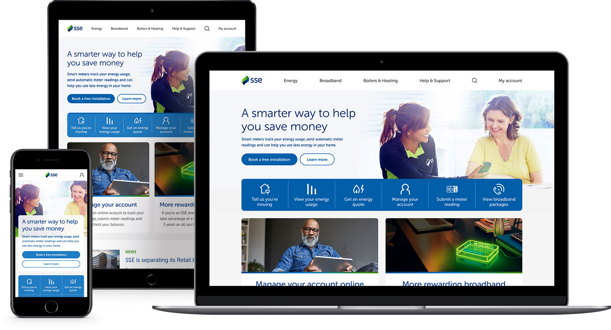

# Homepage Imagery

## Homepage hero

The homepage hero contains the primary message we want users to see when landing on the SSE website. It's the biggest asset on our homepage and is the first thing visitors are likely to see, so care should be taken to ensure that any imagery we use in this space is of a sufficient quality so that it showcases the SSE brand in the best light.

## Homepage promos

The two homepage promos sit below the blue action bar and can contain any kind of message or promotion. With the hero, they form the majority of the homepage layout, so care should be taken to ensure the imagery fits with the SSE brand.

