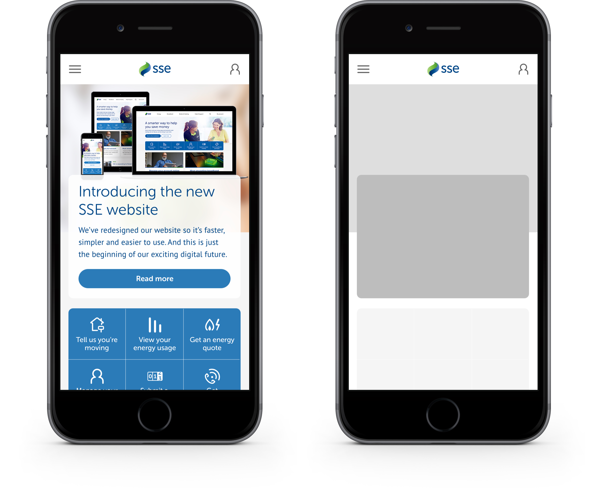
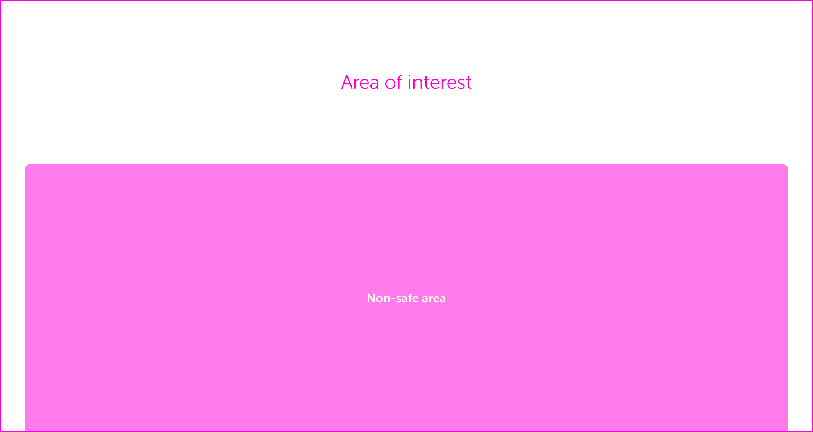

# Homepage Hero

The homepage hero contains the primary message for the SSE homepage. When creating imagery for this asset, either yourself or via a third-party agency, follow these guidelines to ensure your imagery works across all breakpoints and devices.

## Hero image sizing

There are three sizes of hero image for the various breakpoints. When preparing new imagery for the homepage hero, you'll need to create assets at these sizes:

* 768px by 295px
* 992px by 580px
* 1600px by 400px

**We have PSD templates for each size which you must use to compose, store and export your imagery.** This ensures all homepage hero imagery is contained in the same place. Speak to a member of the UX team to access the templates.

### Small \(768 x 295 @2x\)

At the small breakpoint, the homepage hero is a fixed height with a panel that covers the bottom half of the image. This is shown below as the 'non-safe area'.

The non-safe area of this image is where the white panel containing the message  text sits, so ensure that the main focus of your image sits outside this area.

In the example above, the image has been appropriately composed so that the main area of interest within the image is positioned above the non-safe area, ensuring it's visible when published on the site. 

The image below has not been appropriately composed, resulting in parts of the image not being visible when published.

### Medium \(992 x 580 @2x\)

The medium image size has the same sort of non-safe area as the small image does, and the same rules apply.

