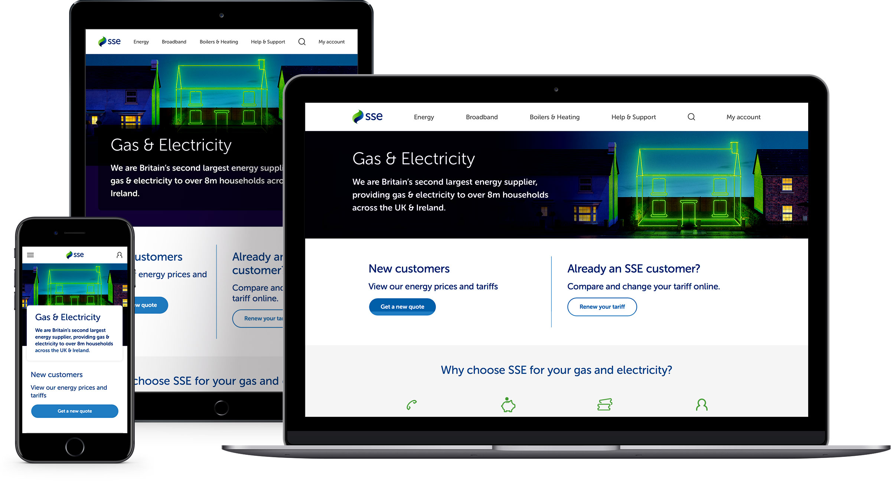
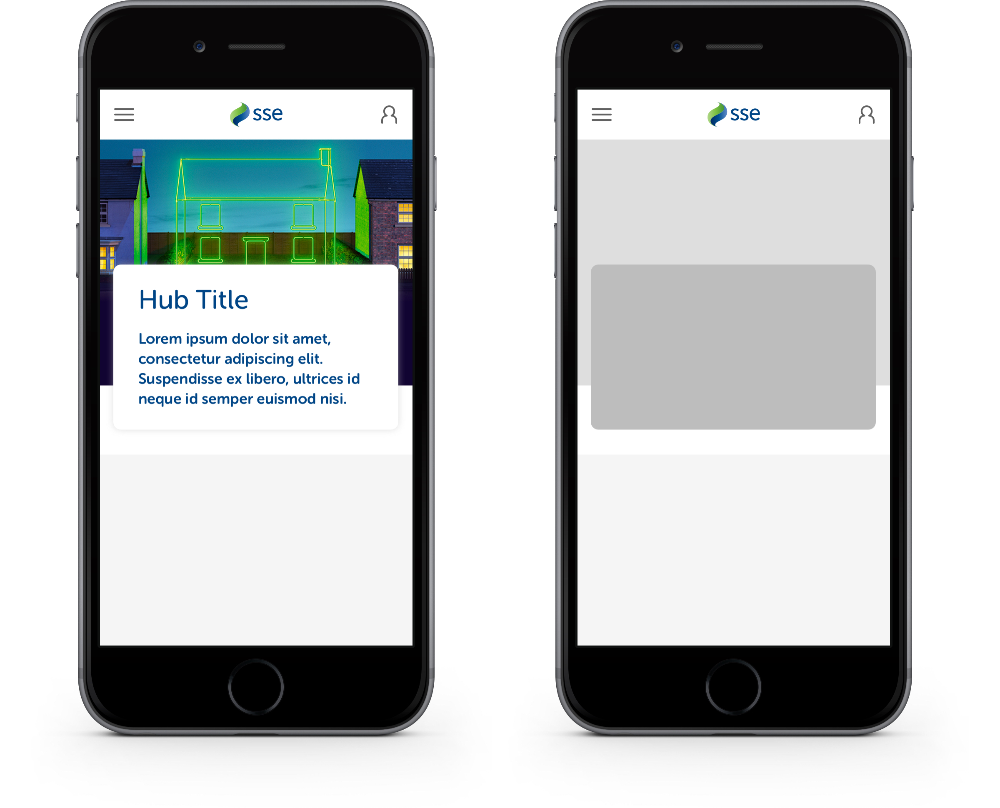
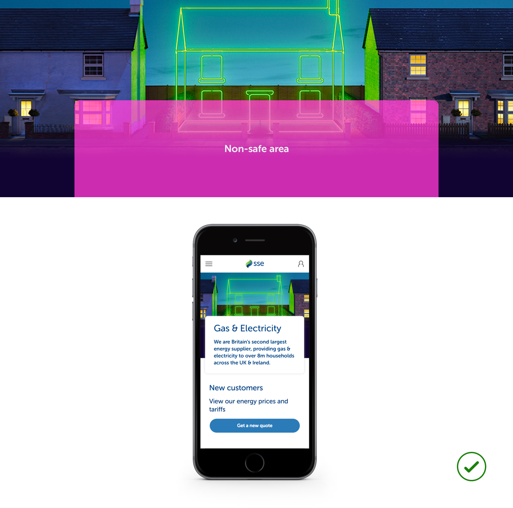
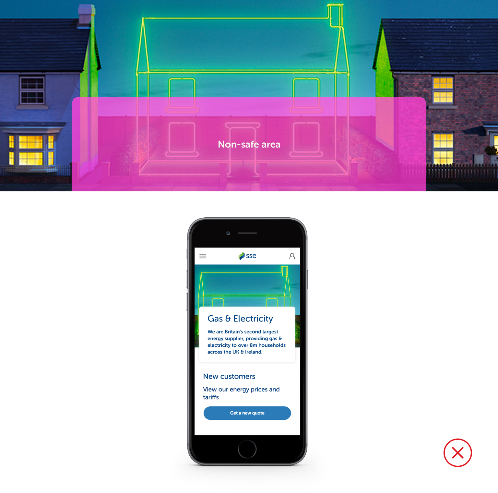
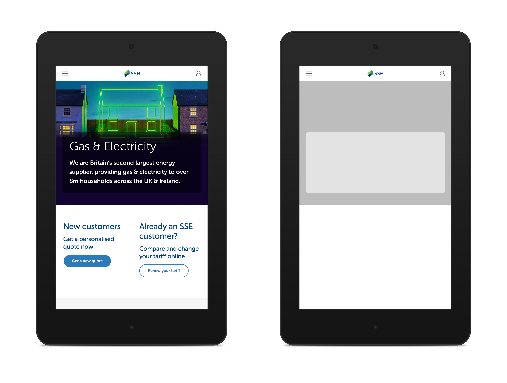
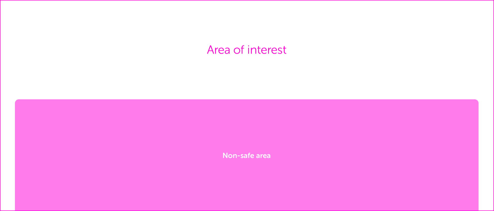
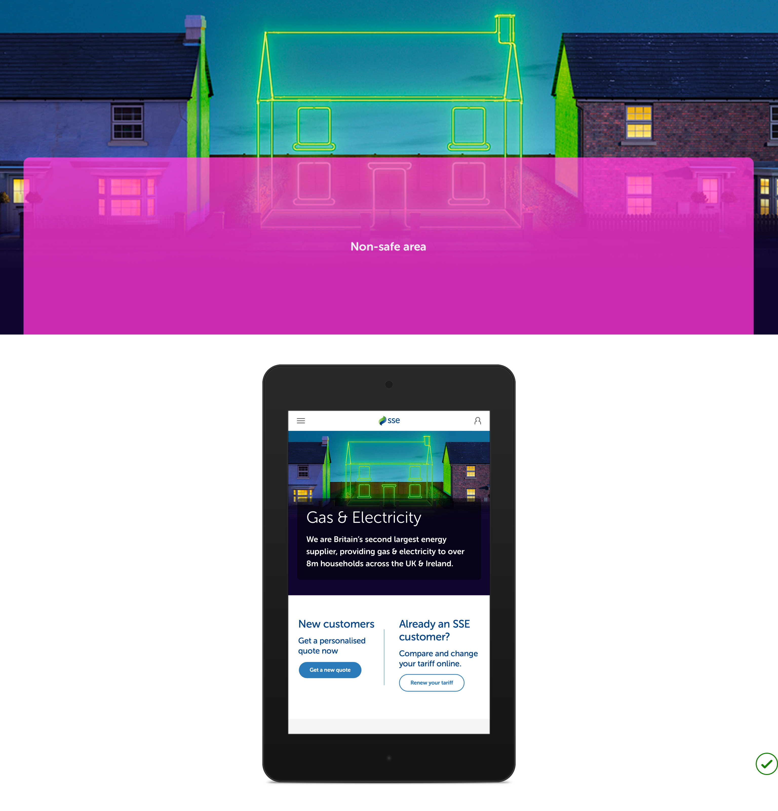
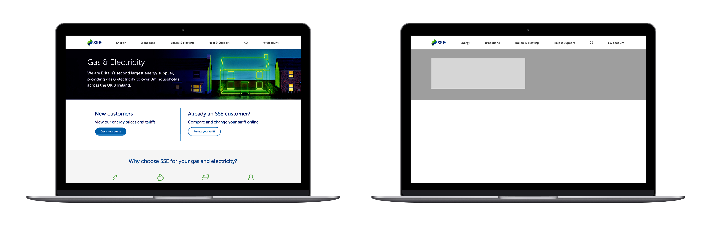
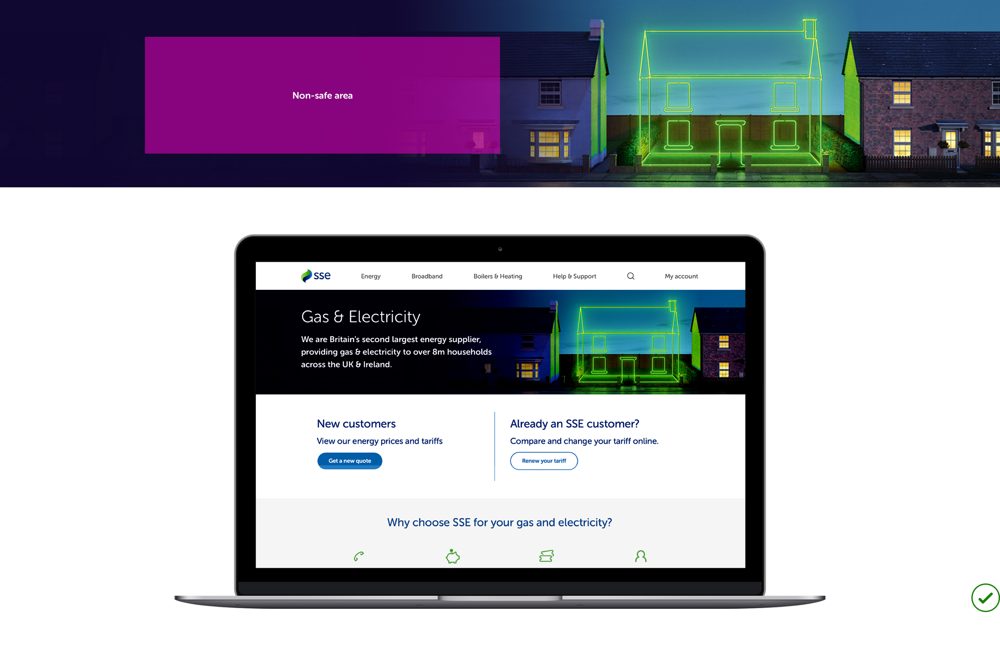
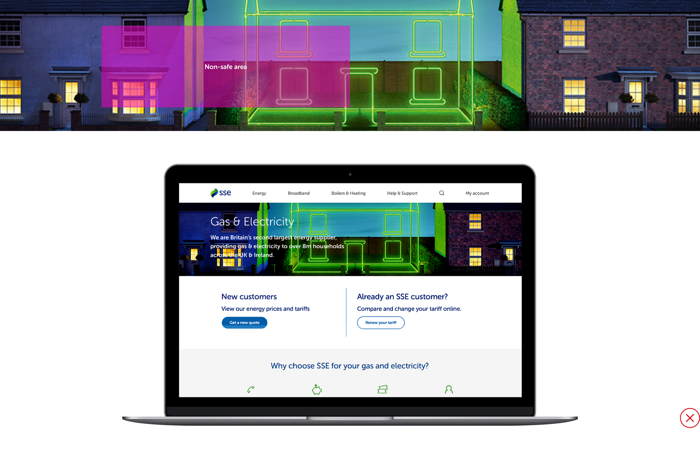

# Hub Page Hero Imagery

## Hero image sizing

There are three sizes of hero image for the various breakpoints. When preparing new imagery for the  hero space, you'll need to create assets at these sizes:

* 768px by 295px
* 992px by 426px
* 1600px by 300px


**Note:** the sizing of hub imagery is different to that of the homepage hero imagery


**We have PSD templates for each size which you must use to compose, store and export your imagery.** This ensures all hero imagery is contained in the same place. Speak to a member of the UX team to access the templates.

## Small \(768 x 295 @2x\)

At the small breakpoint, the hero is a fixed height with a panel that covers the bottom half of the image. This is shown below as the 'non-safe area'.

The non-safe area of this image is where the white panel containing the message text sits, so ensure that the main focus of your image sits outside this area.

In the example above, the image has been appropriately composed so that the main area of interest within the image is positioned above the non-safe area, ensuring it's visible when published on the site. 

The image below has not been appropriately composed, resulting in parts of the image not being visible when published.

## Medium \(992 x 426 @2x\)

The medium image size has the same sort of non-safe area as the small image does, and the same rules apply.

As with the small breakpoint, ensure the area of interest is not obscured by the non-safe area to ensure it looks as expected when published.

## Large \(1600 x 300 @2x\)

The large version of the hero does not use a panel to house the message content – the content floats to the left of the hero image. Care should still be taken to ensure the area of interest is focused on the right-hand side of the image.

Another consideration with the large breakpoint is to ensure there's sufficient contrast within the non-safe area for the message text. The text will either be `$primaryblue` or white, so ensure that whatever parts of the hero image sit underneath the non-safe area remain AA compliant.

To ensure sufficient contrast and maintain readability of the message text, you might need to consider adding a white gradient to the left of your hero image, blurring the background or changing the opacity of the image.

