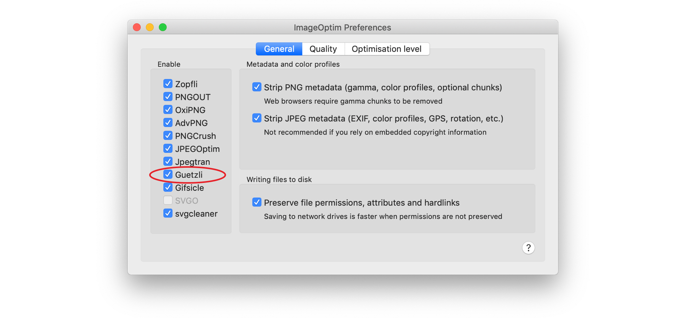

# Preparing & Exporting Imagery

## Preparing imagery

Take care when preparing imagery that it's fit for purpose and meets the guidelines set out in this document depending on what your imagery is to be used for.

## Exporting imagery

Care should be taken to ensure that any imagery created for the hero space does not have an excessively large filesize. Tweak the Photoshop export settings to get the right balance between filesize and image quality. Although there isn't a 'one size fits all' solution, the following export settings can be used as a guide.

| Breakpoint | Export settings |
| :--- | :--- |
| Small | Progressive JPEG; 50% quality |
| Medium | Progressive JPEG; 50% quality |
| Large | Progressive JPEG; 30% quality |

There'll be a trade-off between filesize and image quality which will vary from image to image, so common sense and a keen eye should dictate how to balance this for each image. Take special care if your image contains strong gradients as these tend to degrade to more 'banded' blocks of colour as the quality lessens.

## Compressing further with ImageOptim & Guetzli

Guetzli is a free, open-source JPEG compressor from Google and can be used to further compress JPEG images. If you're on a Mac, download [ImageOptim↗](https://imageoptim.com/mac) and drag the images you want to compress into the main window. Be sure to turn on 'Guetzli' in the preferences – it'll warn you that Guetzli is slow and images may take a long time to compress.

It's a good idea to run copies of your exported JPEGs through ImageOptim \(rather than the original JPEGs\) so you can compare the output to your original JPEGs, in case the results are not as expected.

## Previewing your imagery

Once you've supplied your hero imagery, you should ask to see it in-situ in a browser. Change the size of the browser to explore the different breakpoint: does your image behave as expected? Do you need to alter the composition of any of the breakpoints? Does it load in a suitable time? 

