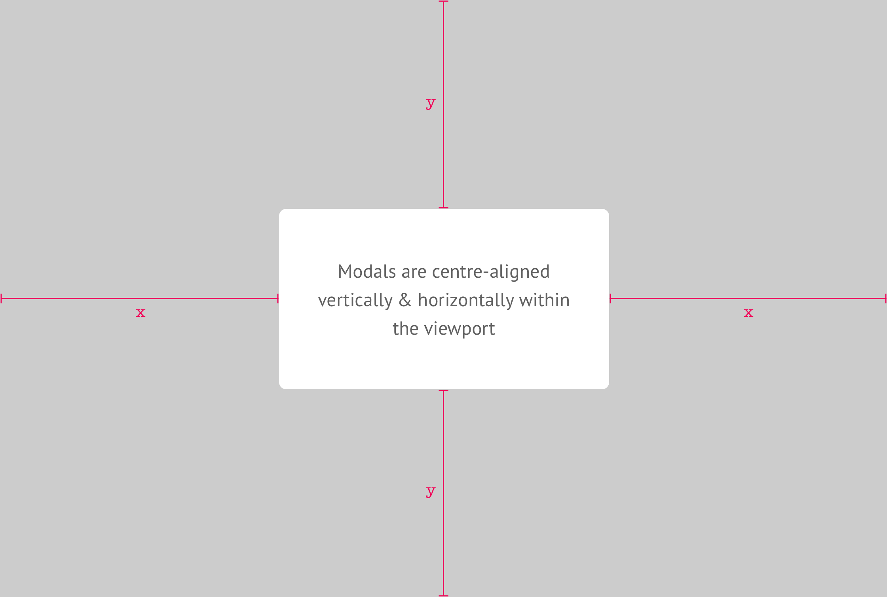
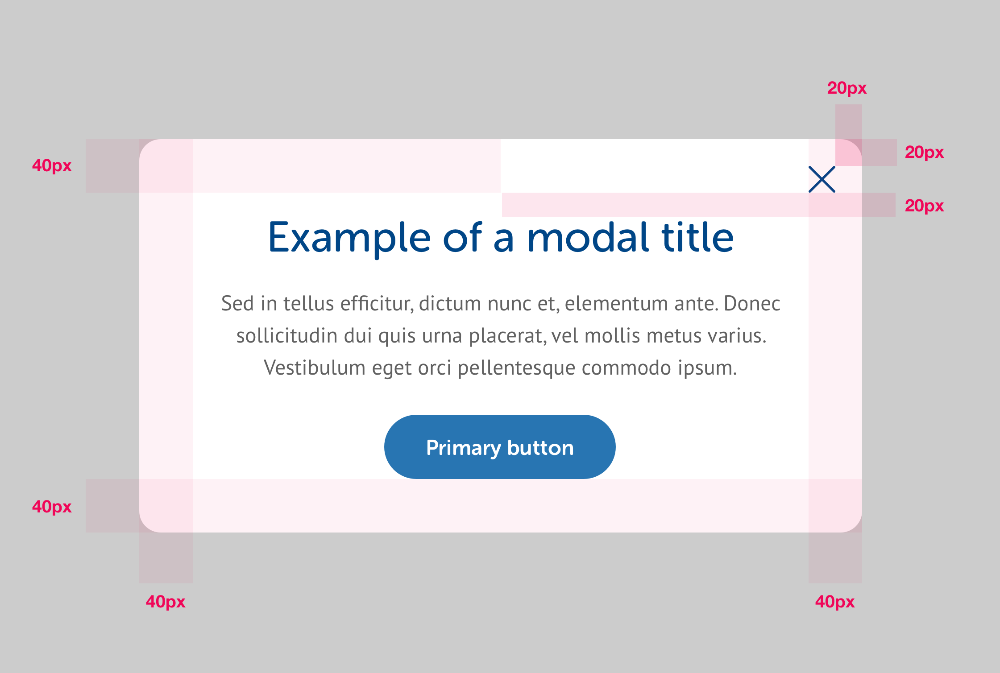
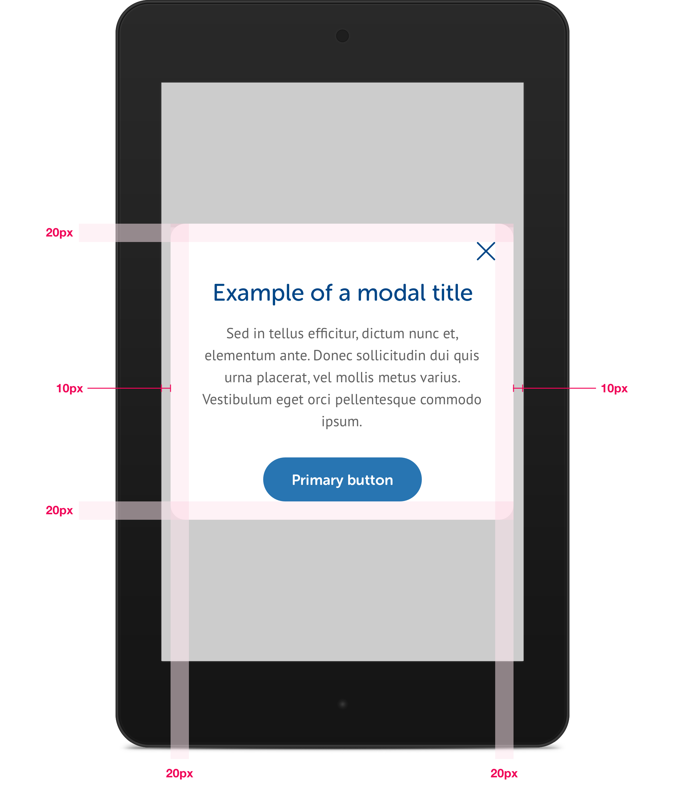

# Modals

Modals are small pop up boxes intended to show users additional information or to prompt them for an additional action, usually where the action will initiate a change of context. Modals appear over the top of the content that invoked them, with an 80% black layer between the modal & content. 

## Size & Positioning

Modals are sized differently for the small, medium & large viewports but are always positioned in the absolute centre of the viewport.



## Large

To ensure they do not get too wide to comfortably read the content, modals have a maximum width of 600px.



```css
max-width: 600px;
corner-radius: 16px;
background-color: #FFF;
close-icon-height: 20px;
close-icon-height: 20px;
```

## Small & Medium

At the small & medium breakpoints, modals are styled the same as the large breakpoint except that there is a gap of 10px to the left & right of the modal.



