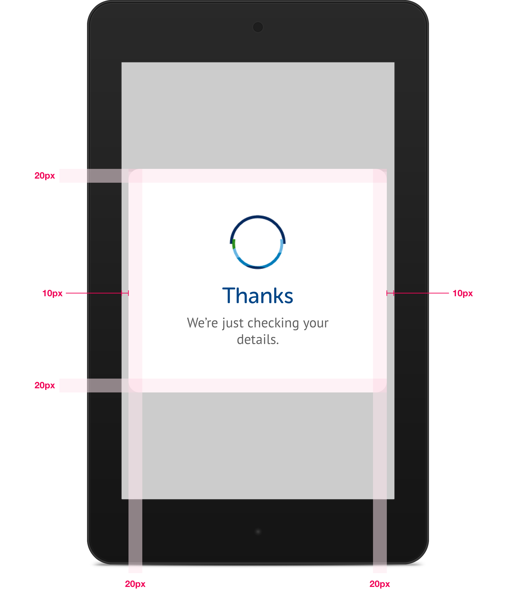
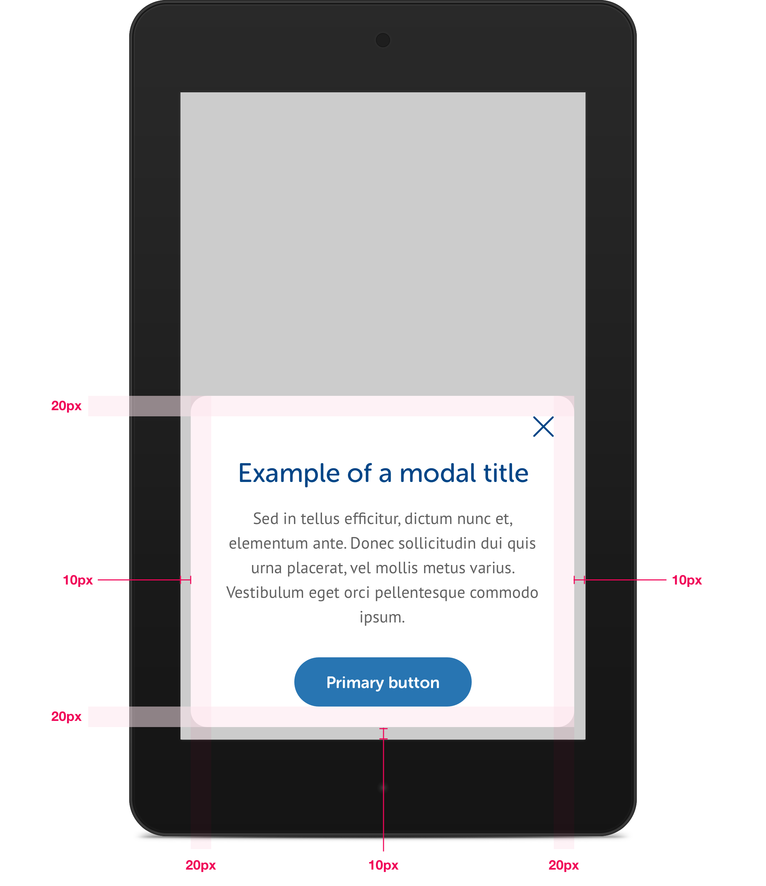

# Modals

Modals are small pop up boxes intended to show users additional information or to prompt them for an additional action, usually where the action will initiate a change of context. Modals appear over the top of the content that invoked them, with an 80% black layer between the modal & content. 


## Large


Interactive and non interactive content adhere to the same rules


### Size:

To ensure they do not get too wide to comfortably read the content, modals have a maximum width of 600px.


```css
max-width: 600px;
corner-radius: 16px;
background-color: #FFF;
close-icon-height: 20px;
close-icon-height: 20px;
```

### Position:


## Small & Medium

At the small & medium breakpoints, modals are styled the same as the large breakpoint except that there is a gap of 10px to the left, right, and bottom of the modal.

Modals at these breakpoints are positioned based on their interactivity.

### Non-interactive modals


Non-interactive modals are modals that disappear after a given time or server response





### Interactive modals


Interactive content includes information modals with close icon buttons


To ensure ease of use for mobile users, modals on small viewports will be positioned in the "thumb friendly zone".




