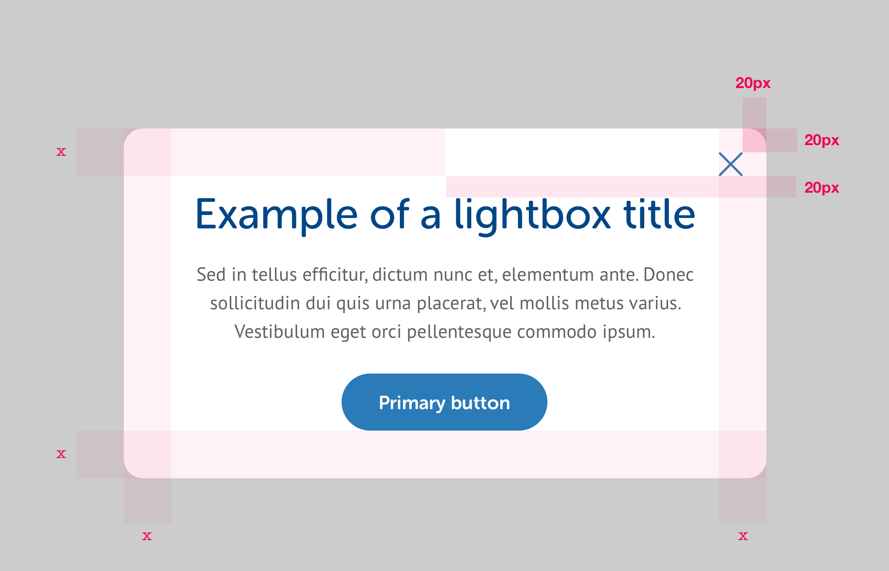

# Lightboxes

Lightboxes are pop up windows intended to quickly prompt users for additional information and action, usually where the action will initiate a change of context. Lightboxes appear over the top of the content that invoked them, with an 80% black layer between the lightbox & content.


**Editor's note:** height? Width? Position?


## Desktop



```css
corner-radius: 16px;
background-color: #FFF;
icon-height: 20px;
icon-height: 20px;

/* Internal padding (x) */
padding-desktop: 40px;
padding-mobile: 20px;
```


