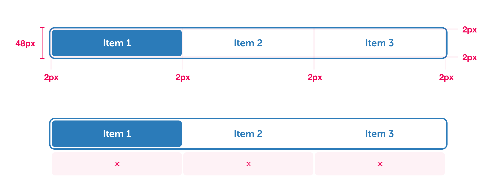

# Toggles


**Editor's note:** the design of this component needs to evolve to be responsive.


* Minimum of 2 items; maximum of 4.
* Each item should occupy the same physical space.
* If the number of items required is greater than 4, consider breaking your content into separate pages.

