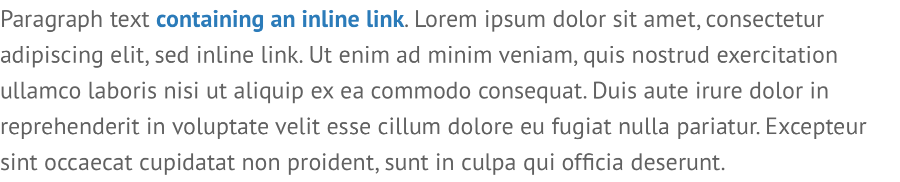

# Body Styles


**Note:** All CSS shown is for basic styling purposes. The intention is not to represent publishable code but to help designers & developers foster a common understanding of the specifications.


## Body copy

The primary style for all body copy.


```css
font-face: PT Sans;
font-size: 16px;
line-height: 24px;
color: $secondaryMidGrey;
```

## Inline links

Used for hyperlinks within a block of body copy.



```css
font-weight: bold;
color: $secondaryBlue;
text-decoration: none;

/* Hover */
text-decoration: underline;
```


