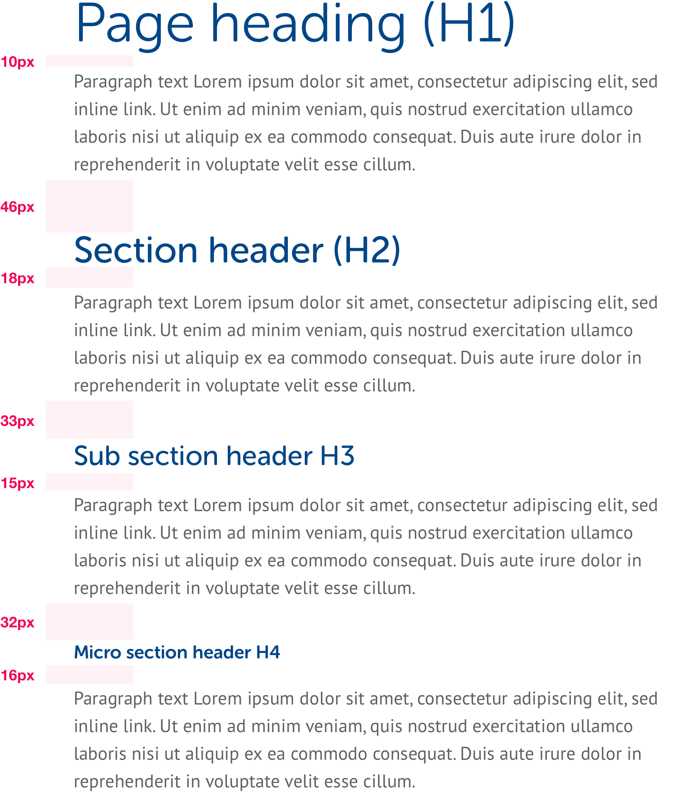

# Spacing

## Headings & body copy

We ensure there is 40px between the [baseline ↗](https://en.wikipedia.org/wiki/Baseline_%28typography%29) of headings and any subsequent body copy. Depending on the style used this leads to the spacing values shown below.

